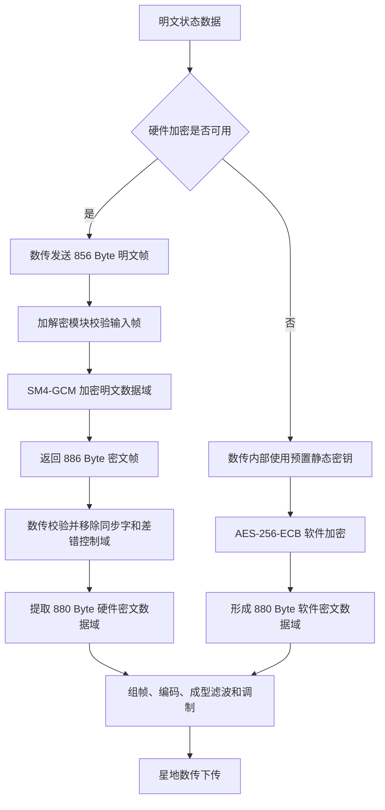

# 数传加密机制与加解密模块通信协议

## 适用范围

数传子系统在数据下传前，根据任务要求选择明文传输或密文传输。密文传输支持以下两种实现方式：

- **硬件加密**：数传与外部加解密模块通信，由加解密模块使用 **SM4-GCM** 算法完成加密。
- **软件加密**：硬件加密不可用时，由数传内部使用 **AES-256-ECB** 算法完成加密，密钥采用预置的静态密钥。

原协议第 9 章描述的“数传发送至加解密模块”和“加解密模块发送至数传”均属于星上硬件加密通信协议。软件加密在数传内部完成，不经过外部加解密模块，因此原协议未单独定义软件加密接口帧。

## 加密方式概览

| 项目 | 硬件加密 | 软件加密 |
| --- | --- | --- |
| 使用条件 | 加解密模块可用时 | 加解密模块不可用时作为降级方式 |
| 执行位置 | 外部加解密模块 | 数传内部 |
| 算法 | SM4-GCM | AES-256-ECB |
| 密钥方式 | 通过密钥序号标识所用密钥 | 预置静态密钥 |
| 算法参数 | 96 bit 密码参数（GCM nonce） | 无协议携带参数 |
| 完整性认证值 | 128 bit MAC 值（GCM TAG） | 无 GCM 类认证值 |
| 数据域长度 | 加解密模块内部密文数据域为 848 Byte；模块输出去除同步字和差错控制域后为 880 Byte | 星地帧数据域加密前后均为 880 Byte，长度和格式不变 |
| 独立模块通信帧 | 有：明文帧 856 Byte，密文帧 886 Byte | 无：在数传内部处理 |

## 数传加密处理流程



### 硬件加密处理

1. 数传 FPGA 按明文状态数据格式生成 856 Byte 明文帧，并发送至加解密模块。
2. 加解密模块首先校验输入帧；校验通过后，使用 SM4-GCM 对 848 Byte 明文数据域进行加密。
3. GCM 密文长度与明文长度相同，因此密文数据域仍为 848 Byte。
4. 加解密模块在密文数据域之外增加密钥序号、96 bit nonce 和 128 bit TAG，生成 886 Byte 密文帧并返回数传。
5. 数传 FPGA 校验返回的 886 Byte 密文帧；校验通过后，删除 4 Byte 同步字和 2 Byte 差错控制域。
6. 剩余的密文数据长度、密文数据域和安全域合计 880 Byte，直接作为数传星地通信协议的数据域，再进入后续组帧、编码和调制流程。

### 软件加密处理

1. 当硬件加密不可用时，数传在内部使用 AES-256-ECB 进行软件加密，不再与外部加解密模块交互。
2. 软件加密使用预置的静态密钥，协议中不传递密钥序号、nonce、TAG 等算法参数。
3. 数传星地通信协议的数据域固定为 880 Byte，能够按 16 Byte 分组完整划分，共 55 个 AES 分组。
4. AES-256-ECB 加密和解密均不改变数据长度，因此软件加密后的密文数据域仍为 880 Byte，地面软件解密后也恢复为 880 Byte 明文数据域，不需要改变长度字段或数据域格式。
5. 因软件加密没有独立的模块间接口，原协议中未体现相应的明文帧、密文帧或安全域定义。

## 硬件加密通信协议（SM4-GCM）

### 协议传输速率与配置

> 原文此节未给出具体内容。

### 协议数据帧格式

#### 数传发送至加解密模块

数传按照以下帧格式（856字节）将明文数据发送给加解密模块做加密，发送数据格式如下表所示。

##### 表 9.2.1.1 数传明文帧格式定义

| 定义 | 同步字 | 明文数据长度 | 明文数据域 | 差错控制域 |
| --- | ---: | ---: | ---: | ---: |
| bit | 32 | 16 | 6784 | 16 |
| Byte | 4 | 2 | 848 | 2 |

帧总长度：**856 Byte**。

##### 表 9.2.1.2 数传明文帧格式定义说明

| 序号 | 域 | 比特数 | 字节数 | 内容 | 备注 |
| ---: | --- | ---: | ---: | --- | --- |
| 1 | 同步字 | 32 | 4 | `0x1ACFFC1D` |  |
| 2 | 明文数据长度 | 16 | 2 | 表示数据域中的有效数据字节长度 |  |
| 3 | 明文数据域 | 6784 | 848 | 有效明文数据，无效明文数据填充全0 |  |
| 4 | 差错控制域 | 16 | 2 | 序号 2、3 的累加和校验 |  |

#### 加解密模块发送至数传

加解密模块按照以下帧格式将密文数据发送给数传，发送数据格式如下表所示，其中安全域是解密必需的参数。

##### 表 9.2.2.1 数传密文帧格式定义

| 定义 | 同步字 | 密文数据长度 | 密文数据域 | 安全域：密钥序号 | 安全域：密码参数 | 安全域：MAC 值 | 差错控制域 |
| --- | ---: | ---: | ---: | ---: | ---: | ---: | ---: |
| bit | 32 | 16 | 6784 | 16 | 96 | 128 | 16 |
| Byte | 4 | 2 | 848 | 2 | 12 | 16 | 2 |

帧总长度：**886 Byte**。

##### 表 9.2.2.2 数传密文帧格式定义说明

| 序号 | 域 | 子域 | 比特数 | 字节数 | 内容 | 备注 |
| ---: | --- | --- | ---: | ---: | --- | --- |
| 1 | 同步字 | 同步字 | 32 | 4 | `0x1ACFFC1D` |  |
| 2 | 密文数据长度 | 密文数据长度 | 16 | 2 | 表示数据域中的有效数据字节长度 |  |
| 3 | 数据域 | 数据域 | 6784 | 848 | 有效密文数据，无效密文数据填充全0 |  |
| 4 | 安全域 | 密钥序号 | 16 | 2 | `0x0000~0xFFFF` |  |
| 4 | 安全域 | 密码参数 | 96 | 12 | GCM的nonce |  |
| 4 | 安全域 | MAC 值 | 128 | 16 | GCM的TAG |  |
| 5 | 差错控制域 | 差错控制域 | 16 | 2 | 序号 2、3、4 的累加和校验 |  |

## 软件加密协议说明（AES-256-ECB）

软件加密沿用数传内部已有的数据域定义，不新增外部接口字段。其协议层约束如下：

| 项目 | 约束 |
| --- | --- |
| 算法 | AES-256-ECB |
| 执行位置 | 数传内部 |
| 密钥 | 预置静态密钥，不随数据帧传输 |
| 明文数据域 | 880 Byte |
| 密文数据域 | 880 Byte |
| 分组长度 | 16 Byte |
| 分组数量 | 55 |
| 密钥序号 | 协议不携带 |
| nonce / IV | ECB 模式不使用，协议不携带 |
| TAG / MAC | 软件加密协议不新增认证值 |
| 长度字段 | 加密前后含义及格式不变 |

软件加密只改变星地帧数据域内容的明密状态，不改变其 880 Byte 长度和编排格式。地面接收端需要使用与星上数传一致的预置静态密钥和 AES-256-ECB 处理规则完成解密，解密前后的数据域长度保持一致。

## 数传星地通信协议

### 协议传输速率与配置

- 数传通道发射频率：X 频段。
- 传输速率：300 Mbps、600 Mbps、900 Mbps、1200 Mbps。

### 协议数据帧格式

为适应 AOS 1024 Byte 标准帧，LDPC 编码采用 CCSDS 131.1-0-2 标准 7/8 码率 `(8176, 7154)` 码的缩短码形式 `LDPC (8160, 7136)`。对每帧数据除 4 Byte 同步字外的数据进行 LDPC 编码，产生 1024 bit 校验信息并附在整帧末尾。下行数传帧参照 CCSDS AOS 协议格式简化，固定帧长为 1024 Byte。

#### 表 10.2.1.1 数传帧格式定义

| 域 | 子域 | 比特数 | 字段合计字节数 |
| --- | --- | ---: | ---: |
| 同步字 | 同步字 | 32 | 4 |
| 主信道识别 | 版本号 | 2 | 2 |
| 主信道识别 | 航天器标识 SCID | 8 | — |
| 主信道识别 | 虚拟信道标识 VCID | 6 | — |
| 虚拟信道计数 | 虚拟信道计数 | 24 | 3 |
| 信令域 | 明密状态 | 4 | 1 |
| 信令域 | 信号速率 | 4 | — |
| 数据域 | 数据域 | 7040 | 880 |
| 填充 | 填充 | 48 | 6 |
| LDPC 校验域 | LDPC 校验域 | 1024 | 128 |

> “字段合计字节数”按合并字段填写：主信道识别的三个子域合计 2 Byte，信令域的两个子域合计 1 Byte。

帧总长度：**4 + 2 + 3 + 1 + 880 + 6 + 128 = 1024 Byte**。

#### 表 10.2.1.2 数传帧格式定义说明

| 序号 | 域 | 子域 | 比特数 | 内容 | 备注 |
| ---: | --- | --- | ---: | --- | --- |
| 1 | 同步字 | 同步字 | 32 | `0x1ACFFC1D` |  |
| 2 | 主信道识别 | 版本号 | 2 | `0b01` | 版本号 2，CCSDS 结构 |
| 3 | 主信道识别 | 航天器标识 SCID | 8 | `XX` | 待定 |
| 4 | 主信道识别 | 虚拟信道标识 VCID | 6 | 空帧：`0b000000`；高分光谱成像载荷数据：`0b000001`；面阵相机成像数据：`0b000010`；固存遥测：`0b000011`；AI 处理机数据：`0b000100` |  |
| 5 | 虚拟信道计数 | 虚拟信道计数 | 24 | 为每个虚拟信道提供单独的计数；初始化为 0，达到 `0xFFFFFF` 后从 0 循环计数 |  |
| 6 | 信令域 | 明密状态 | 4（7:4） | `0x0`：明文传输；`0x1`：软加密传输；`0x2`：硬加密传输 |  |
| 6 | 信令域 | 信号速率 | 4（3:0） | `0x0`：300 Mbps；`0x1`：600 Mbps；`0x2`：900 Mbps；`0x3`：1200 Mbps |  |
| 7 | 数据域 | 数据域 | 7040 | 空帧：全为 `0xAA`；有效数据：相应虚拟信道数据；无效数据：填充 `0xAA` |  |
| 8 | 填充 | 填充 | 48 | `0xAA × 6` |  |
| 9 | LDPC 校验域 | LDPC 校验域 | 1024 | 对整个帧格式除去帧头和校验域的 892 Byte 进行 LDPC 校验，所得校验位放入该区域 |  |

### 加密数据到星地帧数据域的映射

#### 硬件加密场景

加解密模块返回的硬件密文帧总长为 886 Byte。数传校验通过后，去除帧首的 4 Byte 同步字和帧尾的 2 Byte 差错控制域，剩余部分正好为星地帧的 880 Byte 数据域：

```text
880 Byte = 2 Byte 密文数据长度
         + 848 Byte 密文数据域
         + 2 Byte 密钥序号
         + 12 Byte 密码参数（GCM nonce）
         + 16 Byte MAC 值（GCM TAG）
```

因此，硬件加密场景下星地帧数据域完整保留密文长度、密文数据以及地面解密所需的安全域参数。星地帧信令域中的明密状态应设置为 `0x2`。

#### 软件加密与地面软件解密场景

软件加密直接在数传内部对星地帧的 880 Byte 数据域进行 AES-256-ECB 处理。AES-256-ECB 不引入 nonce、TAG 或其他协议参数，且 880 Byte 可以完整划分为 55 个 16 Byte 分组，因此：

```text
软件加密：880 Byte 明文数据域 -> 880 Byte 密文数据域
软件解密：880 Byte 密文数据域 -> 880 Byte 明文数据域
```

软件加密和地面软件解密前后的数据域长度及格式保持一致，星地帧中的数据域长度、填充域和 LDPC 校验域位置均不发生变化。星地帧信令域中的明密状态应设置为 `0x1`。

## 后续设计需要明确的事项

以下内容在当前接口协议中尚未定义，后续优化时需要进一步固化：

- 硬件加密可用性的判定条件、超时门限、重试次数，以及切换至软件加密后的状态上报方式。
- 软件加密静态密钥的注入、标识、更新、轮换、备份恢复和失效机制。
- 软件加密密钥变更时，星上数传与地面解密端的一致性保证方式。
- 软件加密前 880 Byte 数据域中有效数据与无效数据的填充规则，以及地面解密后的有效数据截取规则。
- 软件加密模式缺少 GCM TAG 等认证值时，差错控制域与其他完整性保护机制的责任边界。
- 硬件加密失败、软件加密失败以及两者均不可用时的下传策略和故障处置要求。
