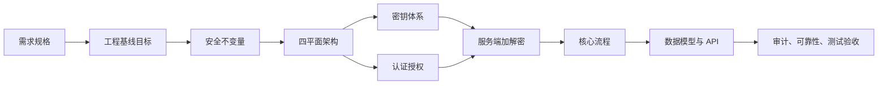
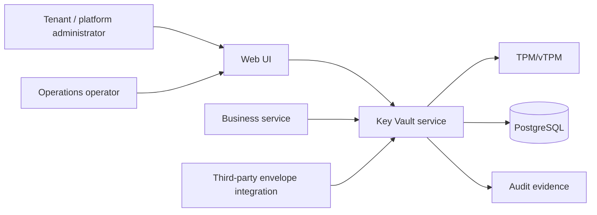
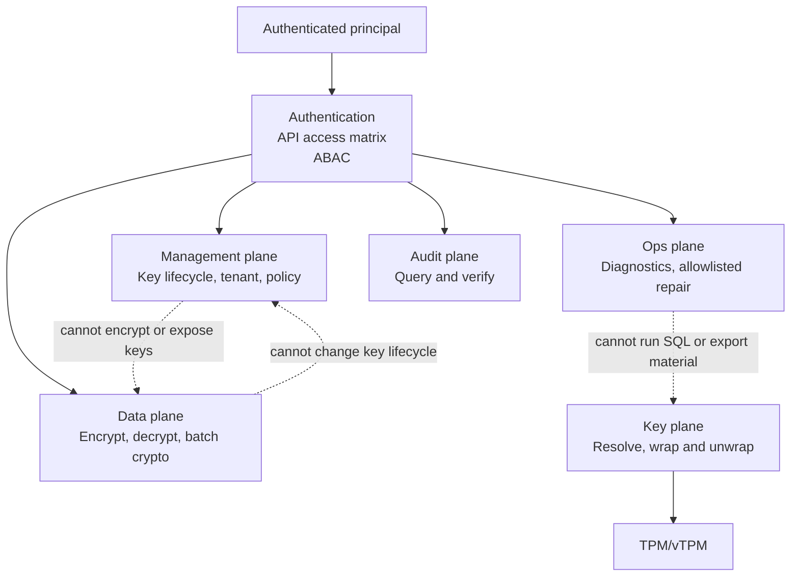
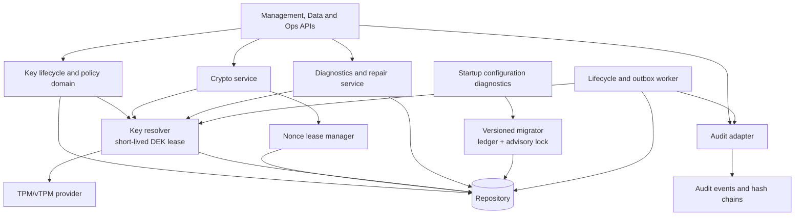
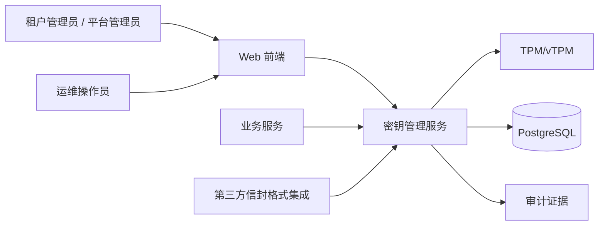
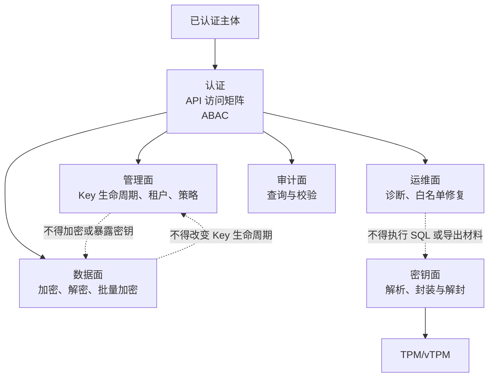
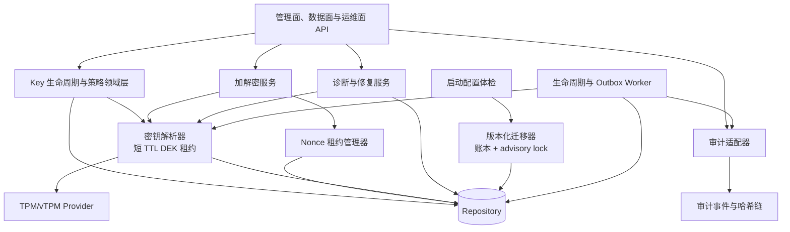
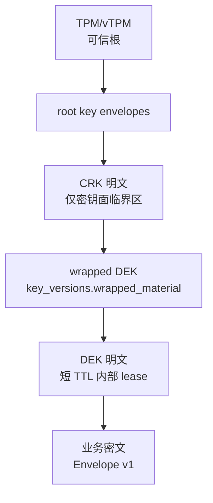
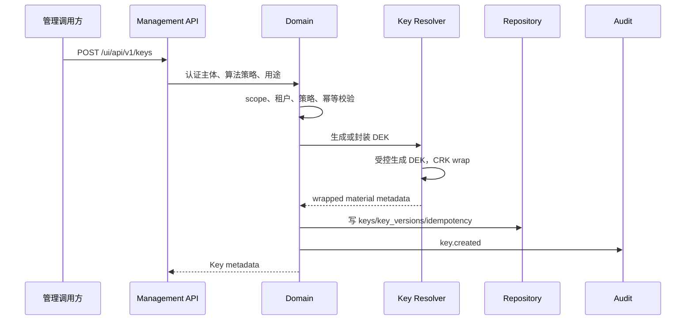
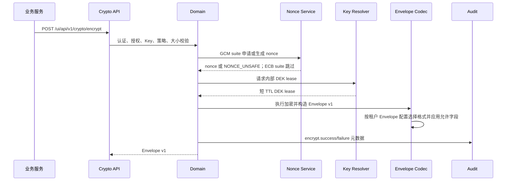

# 基于 TPM 2.0/vTPM 的密钥管理与数据加解密系统总体设计

版本：v1.3
状态：与需求规格 v1.3 对齐
适用范围：工程基线
主要实现语言：Go

## 0. 文档定位

本文是《需求规格说明书》的总体设计落地文档，用于指导架构拆分、详细设计、接口设计、数据建模、测试验收和工程基线运行。当前设计范围只有工程基线，不再拆分；详细设计见《工程基线详细设计》。

### 0.1 文档逻辑

## 1. 系统目标

系统建设为以 TPM 2.0/vTPM 为可信根的集中式密钥托管与服务端密码运算系统，面向内部业务系统和租户应用提供统一的 Key 生命周期管理、受控密钥导入、服务端 Encrypt/Decrypt、批量 Encrypt/Decrypt、审计追踪和工程基线治理能力。

核心设计目标：

1. 根密钥和数据加密密钥明文只允许存在于服务端/key-resolver/TPM 可信边界内。
2. 以租户和业务 Key 为管理单元，提供创建、受控导入、查询、列表、元数据更新、启停、轮转、计划销毁、取消销毁、策略绑定和审计。
3. 客户端只获得业务加解密结果，不获得任何明文密钥材料。
4. 固化 Envelope v1、数据面 opaque AAD、系统内部 AAD canonical、nonce 唯一性、错误码和 KeyVersion 状态机。
5. 隔离管理面、数据面、密钥面和审计面。
6. 在工程基线中提供审计链、生命周期 worker、签名策略 reload、租户信封配置、批量 API、基础限流和容量保护。
7. 将运维可操作性纳入基线：Key 创建支持显式业务 ID 和有效期，过期 Key 必须在查询、加密、解密和生命周期扫描中表现一致。
8. 将第三方格式适配纳入基线：Envelope 配置不仅选择格式，还应描述每种格式可呈现字段的增删改查规则；固定二进制格式不得破坏 wire layout，JSON 格式可承载扩展字段。

## 2. 安全不变量

| 编号 | 不变量 | 设计落实 |
| --- | --- | --- |
| INV-01 | CRK/DEK 明文不得离开可信边界 | API、日志、数据库、备份、审计载荷和 UI 均不得包含明文密钥材料。 |
| INV-02 | 数据库不得存储明文密钥 | `key_versions.wrapped_material` 只能保存受 CRK 或根材料保护的密文。 |
| INV-03 | 数据面不得直连 TPM/vTPM | 数据面只能通过密钥面受控接口获得内部 DEK lease。 |
| INV-04 | GCM nonce 不得复用 | 按 KeyVersion 采用计数器租约或经评审机制控制重复风险；ECB suite 不使用 nonce。 |
| INV-05 | GCM AAD 必须一致 | GCM 解密必须使用加密时完全一致的 caller AAD bytes，并通过 AEAD 认证 AAD；ECB 忽略 caller AAD，不校验 `aad_hash`。 |
| INV-06 | 长期契约演进 | Envelope、数据面 AAD bytes、系统内部 AAD canonical、错误码和状态机必须明确版本化演进。 |
| INV-07 | 租户身份来自认证上下文 | 请求体或路径 tenant 只用于一致性校验。 |
| INV-08 | 管理与数据权限隔离 | 管理 scope 不自动获得数据面权限，数据 token 不能调用管理 API。 |
| INV-09 | 敏感字段不入日志 | token、明文、DEK、CRK、完整 Envelope、wrapped material 不进入日志。 |
| INV-10 | 安全关键失败 fail-closed | 不允许回退到软件根密钥、跳过审计或重用 nonce。 |
| INV-11 | 密钥只允许受控导入，禁止导出 | 导入材料只进入密钥面校验和封装流程。 |
| INV-12 | 算法与密钥一一绑定 | 不同算法、模式或用途不得复用同一逻辑 Key。 |
| INV-13 | Key 过期 fail-closed | 到期 Key 对外状态为 `EXPIRED`，不得继续加密或解密；延期必须通过管理面审计操作恢复有效期。 |
| INV-14 | Envelope 扩展不破坏核心契约 | 核心 Envelope 与 GCM AEAD 认证输入不得被扩展字段替代；JSON 扩展字段可被解析忽略，二进制格式扩展必须通过新版本格式演进。 |

## 3. 总体架构

建议按“系统上下文 → 安全平面 → 内部执行链路”的顺序阅读：第一层回答谁在使用系统；第二层回答谁能做什么；第三层回答数据、密钥与审计如何在可信边界内流动。每个英文图后在本节末提供同层级中文图。

### 3.1 Level 1 — System context (English)

### 3.2 Level 2 — Planes and authority (English)

### 3.3 Level 3 — Internal execution and trust boundaries (English)

### 3.4 第一层：系统上下文（中文）

### 3.5 第二层：平面与权限（中文）

### 3.6 第三层：内部执行与可信边界（中文）

工程基线支持内存 Repository 用于本地开发和自动化验证，也支持 PostgreSQL 持久化部署。PostgreSQL 通过版本化迁移账本与 advisory lock 保证迁移只执行一次；生产部署必须使用 PostgreSQL、原生 TPM provider 与物理平面隔离。

## 4. 平面隔离

| 平面 | 职责 | 禁止事项 |
| --- | --- | --- |
| 管理面 | Key CRUD、受控导入、启停、轮转、销毁计划、延期、租户配置、Envelope 字段配置、策略管理。 | 返回明文密钥；执行数据面加解密热路径；绕过状态机。 |
| 数据面 | Encrypt、Decrypt、批量加解密、Envelope 编解码、`aad_b64` 数据面一致性输入、GCM nonce 控制、按租户配置输出允许的 Envelope 格式。 | 改变 Key 生命周期；直连 TPM/vTPM；向客户端返回明文密钥材料。 |
| 运维面 | 只读诊断、CRK envelope 脱敏状态、白名单修复、resolver 刷新、lifecycle/outbox 干预、数据库迁移状态查看、break-glass 应急治理。 | 任意 SQL；直接查看或导出 CRK/DEK/wrapped material；绕过审计；绕过 24 小时销毁冷静期。 |
| 密钥面 | CRK 解封、DEK wrap/unwrap、短 TTL DEK lease、TPM/vTPM 交互。 | 暴露公网 API；承担业务授权决策；记录或返回明文密钥。 |
| 审计面 | 审计事件、哈希链、验证报告、按权限删除基线审计事件、outbox 审计转发。 | 审计失败时静默成功；记录明文、token、DEK、CRK 或完整敏感载荷。 |

运维面不是管理面的超集，而是独立受控控制面。管理面负责业务 Key 生命周期和租户配置；运维面负责系统修复、诊断和应急处置。静态 token、JWT/HMAC claim、scope 和 UI 路由均必须能区分 `management`、`data` 与 `ops` plane。

## 4.1 运维面行业参考与取舍

公开产品实践给本系统提供了几个直接约束：

1. HashiCorp Vault 将审计设备作为安全边界的一部分，并提供 operator 级的 seal/unseal、rekey、rotate 等命令。因此本系统 Ops Plane 必须把 operator 操作和普通管理操作分离，并要求变更型运维动作审计先行。
2. AWS KMS 的 KMS key deletion 使用等待期，Google Cloud KMS 的 key version destruction 也采用计划销毁和可恢复窗口，Azure Key Vault soft-delete/purge protection 将删除和最终 purge 分离。因此本系统不允许 Ops Plane 直接绕过 24 小时 Key 销毁冷静期。
3. 云 KMS 和 Vault 均避免把底层密钥材料暴露给日常管理面。因此本系统 Ops Plane 只能查看 digest、长度、版本、状态和错误码，不得返回 CRK/DEK/wrapped material 原文。

参考资料：

- HashiCorp Vault Audit Devices: https://developer.hashicorp.com/vault/docs/audit
- HashiCorp Vault Operator: https://developer.hashicorp.com/vault/docs/commands/operator
- AWS KMS Deleting KMS keys: https://docs.aws.amazon.com/kms/latest/developerguide/deleting-keys.html
- Google Cloud KMS Destroy and restore key versions: https://cloud.google.com/kms/docs/destroy-restore
- Azure Key Vault soft-delete overview: https://learn.microsoft.com/en-us/azure/key-vault/general/soft-delete-overview

由此形成工程基线的 Ops Plane 规则：

1. 所有动作必须是白名单动作，不能提供 SQL console、shell console 或通用脚本执行。
2. 读操作使用 `ops:read`，普通修复使用 `ops:repair`，应急动作使用 `ops:breakglass`。
3. `ops:breakglass` 请求必须包含 `reason`、`ticket_id` 和 `Idempotency-Key`，并写入审计链。
4. 运维面响应必须脱敏，字段以状态、hash、长度、计数、时间戳和稳定错误码为主。
5. 运维面可以触发 resolver refresh、CRK AAD digest 修复、lifecycle job retry、outbox replay、异常节点隔离，但不得替代密钥面执行明文密钥操作。

## 5. 密钥体系与 TPM/vTPM

统一密钥层次为：`TPM/vTPM -> NRWK/TPM object -> CRK -> DEK -> Data`。TPM/vTPM 是硬件可信根；NRWK 是不可导出的 TPM 对象能力；CRK 保护持久化 DEK；DEK 执行业务数据加解密。`crk_aad_digest` 仅是应用层完整性校验，不能替代 TPM policy 或对象授权策略。

设计说明：

1. TPM/vTPM 保护根材料或根材料 envelope，不参与业务数据高频加解密。
2. CRK 明文只能在 key-resolver 受控临界区短暂存在。
3. DEK 入库前必须被 CRK 或受控根材料封装。
4. DEK 明文只允许在服务端密码运算过程中短暂出现，不得返回客户端。
5. KeyVersion 持久化记录根密钥版本、封装算法、策略版本和校验信息，为后续 CRK 轮转预留演进元数据。

生产级 TPM provider 必须优先采用 TSS/ESAPI 原生库实现，不得依赖 shell、PATH 或外部命令管道传递明文根材料。命令行 `tpm2-tools` provider 仅作为工程基线和受控环境 fallback：必须固定工具绝对路径、使用白名单环境变量、限制 state/tmp 目录权限、对命令输出脱敏截断、尽量覆写删除 CRK 临时文件，并在文档和配置中标记为非生产首选。CRK envelope 必须持久化并校验完整 `CRKAAD` digest；生产实现还应将 cluster、node、plane role、baseline digest、policy digest 等上下文纳入 TPM policy/PCR/PolicyAuthorize 约束，而不是只依赖应用层字段比较。

## 6. 核心流程

### 6.1 Key 创建

### 6.2 Key 元数据更新

`PATCH /ui/api/v1/keys/{id}` 只允许更新名称、标签和 `expires_at`。租户、算法 suite、策略、状态、当前版本、历史版本和 wrapped material 均不可通过此接口修改。更新 `expires_at` 可用于已过期 Key 的延期；延期是管理面操作，必须经过授权和审计，不得改变 KeyVersion 或 wrapped material。

### 6.2.1 Key 有效期

Key 可在创建和受控导入时指定显式 `key_id` 与 `expires_at`。`expires_at` 到期后，Key 对外查询状态应呈现为 `EXPIRED`，加密和解密均 fail-closed。生命周期 worker 应周期扫描到期 Key，并通过领域状态机或等效检查形成可观测状态；用户需要继续使用时，只能通过管理面延期。

### 6.3 安全删除

`DELETE /ui/api/v1/keys/{id}` 的语义是计划销毁，不执行立即物理删除。接口将 Key 转为 `DESTROY_PENDING`，保留历史元数据和审计证据；到期销毁由生命周期 worker 按状态机和审计要求执行。

### 6.4 加密

### 6.5 解密

解密必须按 Envelope 指定 KeyVersion 和策略执行，不能使用当前版本替代历史版本。Key 或 KeyVersion 处于不允许解密的状态时按状态机拒绝。

### 6.6 批量加解密

批量 API 最多 100 条。认证和外层限流可共享，每个条目必须独立校验 Key、KeyVersion、AAD bytes、状态、权限和策略；GCM 条目额外校验 nonce。批量加密和批量解密均采用 `entries` 输入模型，AAD 通过每条记录的 `aad_b64` 传入，响应按输入顺序返回逐条结果，失败条目返回稳定错误码；解密成功条目返回 base64 明文，不返回任何密钥材料。

### 6.7 Envelope 配置

租户 Envelope 配置由 `default_format`、`allowed_formats` 和 `profiles` 组成。每个 profile 绑定一个已注册 `adapter`，并通过 `field_mappings` 与 `extensions` 描述外部格式字段如何映射到 CoreEnvelope、derived 值或 extension 值。JSON/profile 格式允许在核心字段之外携带扩展字段，解密解析必须忽略不参与认证的扩展字段并继续以核心字段重建 Envelope；数据面 caller AAD 不从 Envelope 重建，而是由调用方通过 `aad_b64` 明确传入；`kvlt-binary-v1` 是固定 wire layout，profile 不得改变已发布二进制布局。

`magic` 是 `kvlt-binary-v1` 的二进制 wire-format discriminator，固定为 `KVLT`，用于二进制格式识别、防误解析，并作为 binary protected header 的一部分参与 GCM AEAD AAD 构造。`magic` 不属于 CoreEnvelope 的业务语义字段，不是租户可配置字段，也不要求 `json-v1`、`configurable-json-v1` 或第三方 profile 格式呈现；外部 JSON/profile 只需通过字段映射还原完整 CoreEnvelope。

数据面 caller AAD 是调用方提供的 opaque bytes。第三方系统可按自己的 JSON、XML、Protobuf、header 或业务上下文生成 AAD，但 canonical 步骤必须在调用方或 SDK 完成。GCM suite 将 `aad_b64` 解码结果作为 AEAD AAD 使用，并执行最大 64 KiB 长度限制、`SHA-256(aad_bytes)` 审计和加解密一致性校验；ECB suite 忽略 caller AAD，Envelope wire/JSON 不携带 `aad_hash` 且解密不校验 AAD。AAD 明文不进入 Envelope 核心字段，也不得写入审计日志。

## 7. 数据模型

| 表/对象 | 用途 |
| --- | --- |
| `tenants` | 租户元数据、状态、配置引用。 |
| `keys` | 逻辑 Key、算法策略、用途、状态、有效期。 |
| `key_versions` | KeyVersion、wrapped material、根版本、状态。 |
| `crk_versions` | 根密钥版本元数据和后续轮转演进字段。 |
| `root_key_envelopes` / `crk_node_envelopes` | TPM/vTPM 保护的根材料 envelope。 |
| `dek_leases` | 内部短 TTL lease 元数据。 |
| `nonce_usage_records` / `nonce_leases` | nonce 风险水位、计数器或区间分配记录。 |
| `crypto_policies` | 算法、模式、用途、租户策略和策略版本。 |
| `tenant_envelope_configs` | 租户信封默认格式、允许格式和按格式分组的 profiles。 |
| `audit_events` | 结构化审计事件，基线允许授权删除以支持演示和测试环境清理。 |
| `audit_chain_heads` | 审计哈希链头和验证状态。 |
| `outbox_events` | 领域事件和异步投递状态。 |
| `lifecycle_jobs` | 生命周期异步任务。 |
| `idempotency_keys` | 管理 API 幂等。 |

## 8. API 设计

| API | 设计 |
| --- | --- |
| `POST /ui/api/v1/keys` | 创建 Key 和初始 KeyVersion，可指定 `key_id` 与 `expires_at`。 |
| `GET /ui/api/v1/keys/{id}`、`GET /ui/api/v1/keys` | 返回 Key 元数据，不返回 wrapped material。 |
| `PATCH /ui/api/v1/keys/{id}` | 更新名称、标签和有效期。 |
| `DELETE /ui/api/v1/keys/{id}` | 计划销毁 Key。 |
| `POST /ui/api/v1/keys/{id}:enable` / `/enable` | 启用 Key。 |
| `POST /ui/api/v1/keys/{id}:disable` / `/disable` | 禁用 Key。 |
| `POST /ui/api/v1/keys/{id}:rotate` / `/rotate` | 生成新 KeyVersion。 |
| `POST /ui/api/v1/keys/{id}/schedule-destroy` | 计划销毁入口。 |
| `POST /ui/api/v1/keys/{id}/cancel-destroy` | 取消计划销毁。 |
| `POST /ui/api/v1/crypto/encrypt` | 小对象加密。 |
| `POST /ui/api/v1/crypto/decrypt` | 小对象解密。 |
| `POST /ui/api/v1/crypto/encrypt-batch` | 批量加密。 |
| `POST /ui/api/v1/crypto/decrypt-batch` | 批量解密，采用 entries 输入模型。 |
| `GET/PUT /ui/api/v1/tenants/{id}/envelope-config` | 管理租户信封默认格式、允许格式和 profiles。 |
| `GET /ui/api/v1/envelope/formats` | 返回已注册格式和适配信息。 |
| `POST /ui/api/v1/policies:reload` | 加载签名策略包。 |
| `GET /ui/api/v1/audit/events`、`DELETE /ui/api/v1/audit/events` | 查询或按授权删除脱敏审计事件。 |
| `GET /ui/api/v1/audit/chain/verify` | 验证审计链。 |
| `GET /ui/api/v1/lifecycle/jobs`、`GET /ui/api/v1/lifecycle/outbox`、`GET /ui/api/v1/lifecycle/config` | 查询 worker 任务、outbox 和运行参数。 |
| `GET /ui/api/v1/ops/health` | 查询运维聚合健康状态。 |
| `GET /ui/api/v1/ops/db/status` | 查询数据库迁移、连接、容量和积压摘要。 |
| `GET /ui/api/v1/ops/crk/envelope` | 查询 CRK envelope 脱敏状态。 |
| `POST /ui/api/v1/ops/crk/envelope:repair-aad-digest` | 修复 CRK envelope AAD digest 并刷新 resolver。 |
| `POST /ui/api/v1/ops/lifecycle/jobs/{id}/retry`、`POST /ui/api/v1/ops/outbox/{id}/replay` | 运维面白名单任务干预。 |

## 9. 可靠性与可观测性

工程基线提供健康检查、结构化日志、审计链验证、worker 任务查询、worker 运行参数查询、策略 reload 结果和基础容量保护。生产级 SLO、RTO/RPO、数据库 HA 和恢复演练不由内存仓库基线承诺。管理 UI 可对大量 outbox 事件做折叠展示，但折叠只影响呈现，不改变审计与 outbox 数据语义。

至少应提供或保留以下指标口径：

| 指标 | 用途 |
| --- | --- |
| `kv_http_requests_total` | 请求量和错误率。 |
| `kv_http_request_duration_seconds` | 延迟 SLO。 |
| `kv_dek_lease_cache_hit_ratio` | DEK lease 缓存效率。 |
| `kv_tpm_unseal_total` | TPM 压力和失败率。 |
| `kv_nonce_risk_ratio` | KeyVersion nonce 使用风险或加密次数水位。 |
| `kv_audit_queue_lag_seconds` | 审计积压。 |
| `kv_lifecycle_job_total` | 生命周期任务健康。 |
| `kv_policy_reload_total` | 策略加载、失败和回滚。 |
| `kv_rate_limited_total` | 配额和限流触发情况。 |

## 10. 测试与验收

| 类别 | 验收点 |
| --- | --- |
| Key CRUD | 创建、查询、列表、元数据更新、计划销毁、取消销毁均可验证。 |
| 密钥生命周期 | 启用、禁用、轮转、到期销毁状态机测试通过。 |
| Key 有效期 | 创建展示有效期；到期状态为 `EXPIRED`；到期后加密和解密拒绝；延期后按状态机恢复。 |
| 服务端加解密 | Envelope v1、数据面 opaque AAD、系统内部 AAD canonical、错 AAD、错版本、禁用 Key、过期 Key、销毁中 Key 测试通过。 |
| 批量 API | 加密和解密均采用 entries；逐条 AAD bytes、状态、权限、策略校验；GCM 条目额外校验 nonce；部分失败稳定返回。 |
| Envelope 配置 | 默认格式、允许格式和 JSON 扩展字段在加密输出、解析和重编码中可验证；二进制格式不破坏 wire layout。 |
| 策略治理 | 签名、加载失败保留最后有效策略、回滚测试通过；策略界面应可查看 suite matrix 并触发授权治理操作。 |
| 审计链 | 删除、截断、重排、字段篡改可检测。 |
| 四平面隔离 | 管理 API 不能执行数据热路径；数据面不能直连 TPM；密钥面不做业务鉴权。 |
| 敏感信息 | 日志、审计、错误、指标和 UI 响应不含 token、明文、DEK、CRK、完整 Envelope。 |

## 11. 演进

1. Envelope v1 发布后不得破坏性修改。
2. 数据面 AAD bytes 契约或系统内部 AAD canonical 修改必须触发设计评审和 Golden Vectors 更新。
3. 错误 `code` 必须稳定，调用方不得依赖 `message` 文本做分支。
4. 新增能力必须先更新需求规格，再更新总体设计和工程基线详细设计。

## 12. 结论

本设计将系统收敛为单一工程基线。TPM/vTPM 作为可信根保护根材料，key-resolver 控制 CRK/DEK 明文生命周期，数据面只执行受授权的服务端加解密，管理面负责 Key CRUD、生命周期和策略，审计面提供哈希链和验证能力。
